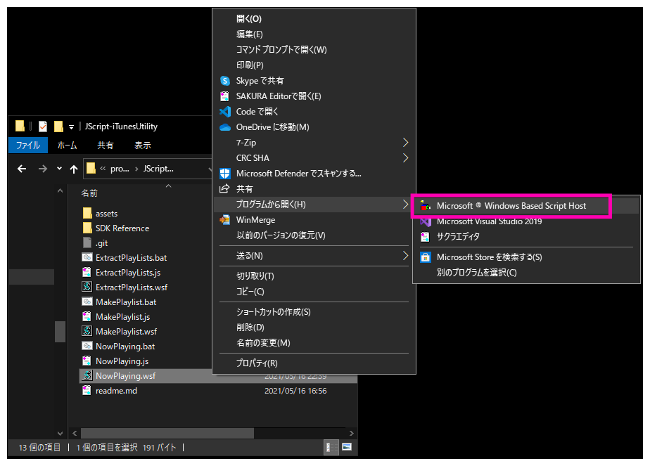

# How To Use

## Run by .wsf or .bat

.wsf で実行する場合は、実行中はコマンドプロンプトが表示されない。その代わり、実行完了時に Windows Script Host による `Done!` の実行完了メッセージが表示される。実行時エラーが発生した場合は、同様に Windows Script Host でエラーメッセージが表示される。    
.bat で実行する場合は、実行中はコマンドプロンプトが表示される。一方で、実行完了時のメッセージは表示されず、エラー時のエラー内容も表示されない。  

## Run by .wsf

.wsf ファイルを右クリックして `プログラムから開く(H)` -> `Microsoft ® Windows Based Script Host` を選択

## Run by batch file

.bat をたたく
