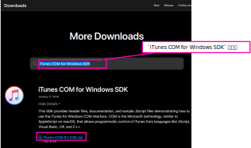

# How To Use

## Run by .wsf or .bat

.wsf で実行する場合は、実行中はコマンドプロンプトが表示されない。その代わり、実行完了時に Windows Script Host による `Done!` の実行完了メッセージが表示される。実行時エラーが発生した場合は、同様に Windows Script Host でエラーメッセージが表示される。    
.bat で実行する場合は、実行中はコマンドプロンプトが表示される。一方で、実行完了時のメッセージは表示されず、エラー時のエラー内容も表示されない。  

## Run by .wsf

.wsf ファイルを右クリックして `プログラムから開く(H)` -> `Microsoft ® Windows Based Script Host` を選択

## Run by batch file

.bat をたたく

# ExportPlayListsAsTsvUTF8

iTunes のプレイリストを TSV ファイルに吐き出す  

吐き出すファイルは `C:\Users\<username>\Documents\iTunesPlayLists` 配下に `<プレイリスト名>.tsv` の形式。 

`<CAUTION!>`  
実行前に iTunes を起動しておく  
`</CAUTION!>`

# ImportPlayListsFromTsvUTF8

ExportPlayListsAsTsvUTF8 で吐き出した TSV ファイル形式のプレイリストファイルを取り込む。  

`<CAUTION!>`  
実行前に以下を実施しておく  
・ExportPlayListsAsTsvUTF8.js で吐き出した TSV ファイルをフルパスで ImportPlayListsFromTsvUTF8.js 内の `var strarr_tsvPaths = new Array(~)` 内に記載しておく  
・iTunes を起動しておく  
`</CAUTION!>`

# NowPlaying

再生中のトラックの曲名、アーティストを TSV ファイルに保存する  
保存先ファイルは `C:\Users\<username>\Documents\iTunesNowPlaying\NowPlaying.tsv`

`<CAUTION!>`  
実行前に iTunes を起動しておく  
`</CAUTION!>`

# [TIPS] iTunes COM for Windows SDK

[https://developer.apple.com/downloads/](https://developer.apple.com/downloads/) にアクセスして Apple ID でログイン

  
